# Scan To CAD

## Download Dataset

```bash
ScanNet :
https://github.com/ScanNet/ScanNet

ShapeNet :
https://shapenet.org/

Scan2CAD :
https://github.com/skanti/Scan2CAD
```

and run this

```bash
ln -s <path-to-ScanNet-folder-root> ./Routines/Script/
ln -s <path-to-ShapeNet-folder-root> ./Routines/Script/
```

## Install Requirements

```bash
conda create -n cad python=3.8
pip install torch torchvision torchaudio --extra-index-url https://download.pytorch.org/whl/cu113
pip install numpy numpy-quaternion plyfile PyWavefront pybind11
```

## Build

```bash
cd Routines/Vox2Mesh
make -j
cd ../DFGen
make -j
cd ../CropCentered
make -j
cd ../..
```

## Run

### Visualize data

```
python ./Routines/Script/Annotation2Mesh.py
```

### Voxelize CADs (shapenet)

```
python ./Routines/Script/CADVoxelization.py
```

### Generate data (correspondences)

```
python ./Routines/Script/GenerateCorrespondences.py
```

### Train heatmap prediction:

```
cd Network/pytorch
./run.sh
```

### Run alignment algorithm:

```
cd Routines/Scripts
python Alignment9DoF.py --projectdir /Network/pytorch/output/dummy
```

### Mesh and view alignment result:

```
cd Routines/Scripts
python Alignment2Mesh.py --alignment ./tmp/alignments/dummy/scene0470_00.csv --out ./
```

## Format of the Datasets

### Format of "full_annotions.json"

The file contains `1506` entries, where the field of one entry is described as:
```javascript
[{
id_scan : "scannet scene id",
trs : { // <-- transformation from scan space to world space 

    translation : [tx, ty, tz], // <-- translation vector
    rotation : (qw, qx, qy, qz], // <-- rotation quaternion
    scale :  [sx, sy, sz], // <-- scale vector
    },
aligned_models : [{ // <-- list of aligned models for this scene
    sym : "(__SYM_NONE, __SYM_ROTATE_UP_2, __SYM_ROTATE_UP_4 or __SYM_ROTATE_UP_INF)", // <-- symmetry property only one applies
    catid_cad  : "shapenet category id",
    id_cad : "shapenet model id"
    trs : { // <-- transformation from CAD space to world space 
        translation : [tx, ty, tz], // <-- translation vector
        rotation : [qw, qx, qy, qz], // <-- rotation quaternion
        scale : [sx, sy, sz] // <-- scale vector
	},
    keypoints_scan : { // <-- scan keypoints 
        n_keypoints` : "(int) number of keypoints",
        position :  [x1, y1, z1, ... xN, yN, zN], // <--  scan keypoints positions in world space
	},
    keypoints_cad : { // <-- cad keypoints 
        n_keypoints` : "(int) number of keypoints",
        position :  [x1, y1, z1, ... xN, yN, zN], // <--  cad keypoints positions in world space
	},
     // NOTE: n_keypoints (scan) = n_keypoints (CAD) always true
    }]
},
{ ... },
{ ... },
]
```

### Format of "cad_appearances.json"

This file is merely a helper file as the information in this file are deducible from "full_annotations.json". The file contains `1506` entries, where the field of one entry is described as:
```javascript
{ 
  scene00001_00 : { // <-- scan id as key
   "00000001_000000000000abc" : 2, // <-- catid_cad + "_" + id_cad as key, the number denotes the number of appearances of that CAD in the scene
   "00000003_000000000000def" : 1,
   "00000030_000000000000mno" : 1,
   ...
  },
  scene00002_00 : {
    ...
  },
},
```

## Data Generation for *Scan2CAD* Alignment

### Scan and CAD Repository

In this work we used 3D scans from the [ScanNet](https://github.com/ScanNet/ScanNet) dataset and CAD models from [ShapeNetCore (version 2.0)](https://www.shapenet.org/). If you want to use it too, then you have to send an email and ask for the data - they usually do it very quickly.

Here is a sample (see in `./Assets/scannet-sample/` and `./Assets/shapenet-sample/`):

| ScanNet Color             |  ScanNet Labels |
:-------------------------:|:-------------------------:
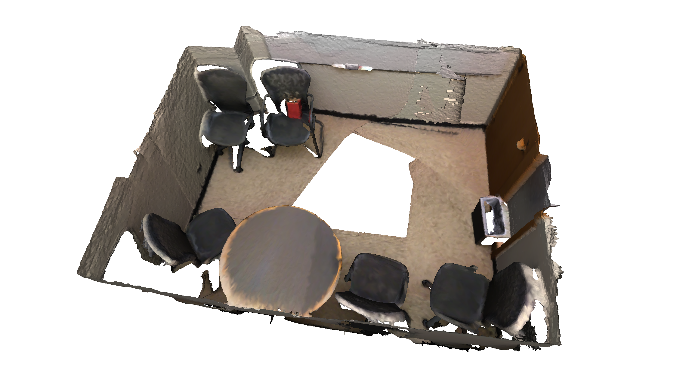  |  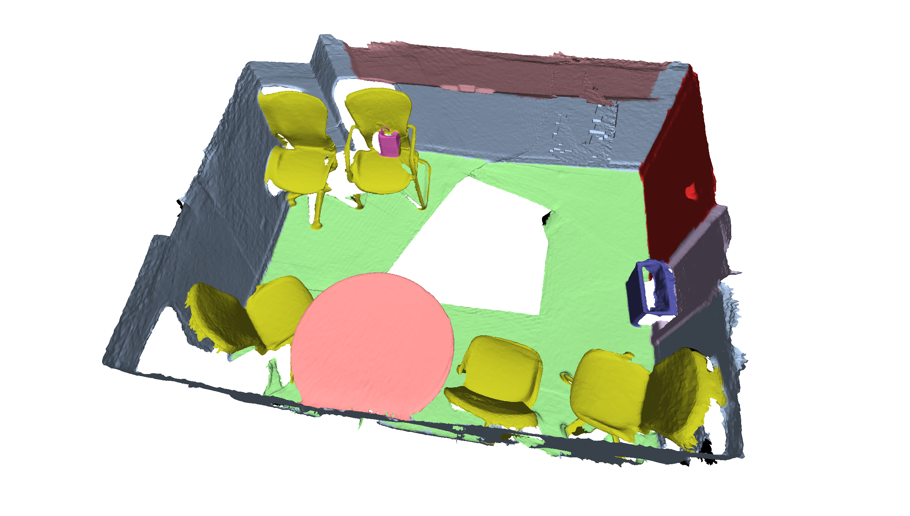

| ShapeNet Trashbin             |  ShapeNet Chair | ShapeNet Table |
:-------------------------:|:-------------------------:|:-------------------------:
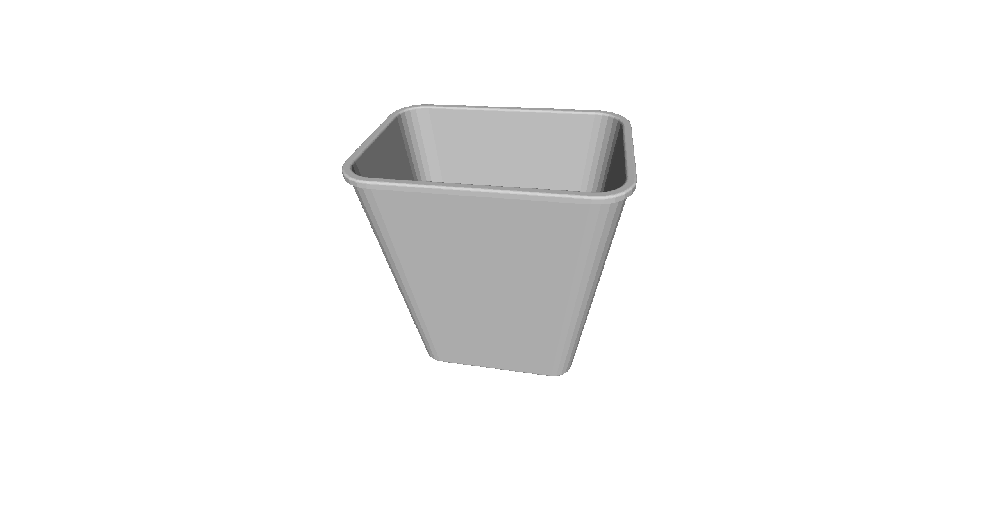  |  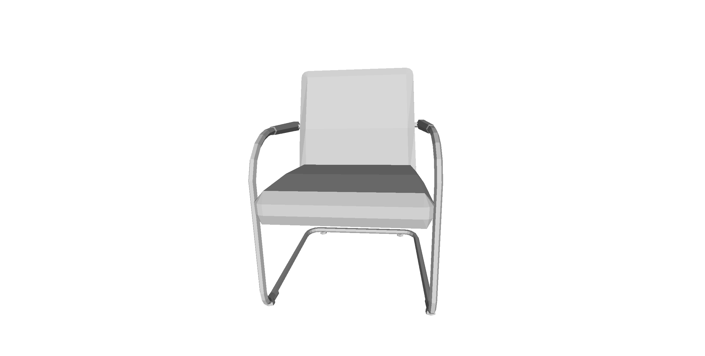 |  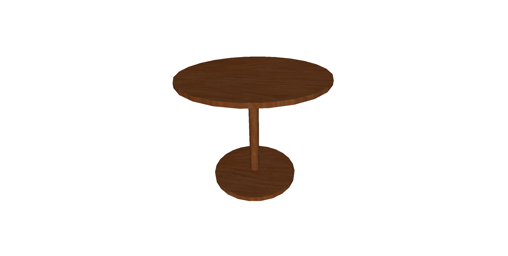

### Voxelization of Data as Signed Distance Function (sdf) and unsigned Distance Function (df) files

The data must be processed such that scans are represented as **sdf** and CADs as **df** voxel grids as illustrated here (see in `./Assets/scannet-voxelized-sdf-sample/` and `./Assets/shapenet-voxelized-df-sample/`):

| ShapeNet Trashbin Vox           |  ShapeNet Chair Vox | ShapeNet Table Vox |
:-------------------------:|:-------------------------:|:-------------------------:
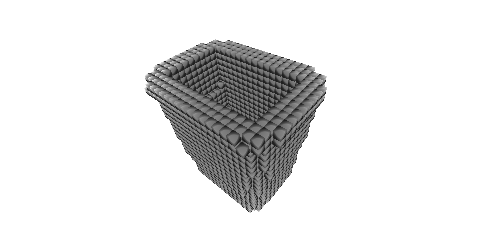  |  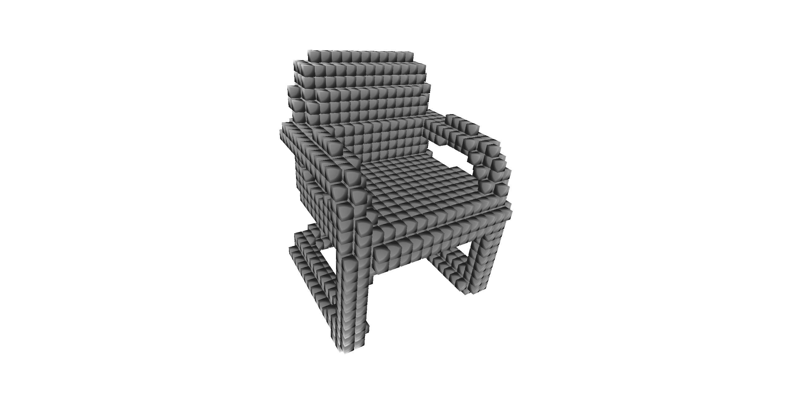 |  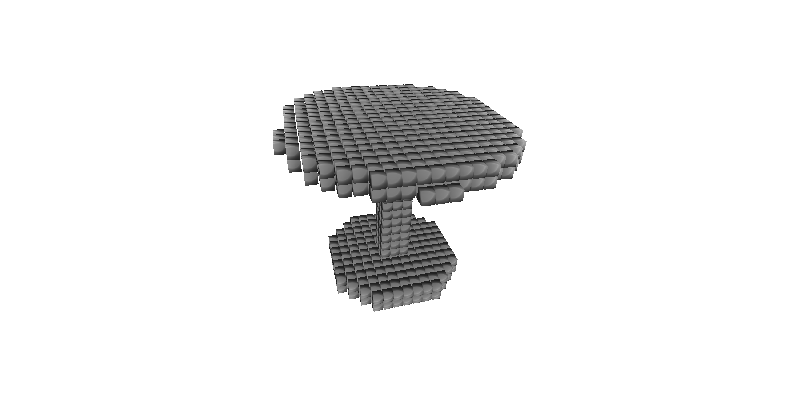

In order to create **sdf** voxel grids from the scans, *volumetric fusion* is performed to fuse depth maps into a voxel grid containing the entire scene.
For the sdf grid we used a voxel resolution of `3cm` and a truncation distance of `15cm`. 

In order to generate the **df** voxel grids for the CADs we used a modification (see `CADVoxelization.py`) of [this](https://github.com/christopherbatty/SDFGen) repo (thanks to @christopherbatty).

### Creating Training Samples

In order to generate training samples for your CNN, you can run `./Routines/Script/GenerateCorrespondences.py`.
From the *Scan2CAD* dataset this will generate following:

1. Centered crops of the scan
2. Heatmaps on the CAD (= correspondence to the scan)
3. Scale (x,y,z) for the CAD
4. Match (0/1) indicates whether both inputs match semantically

The generated data totals to approximately `500GB`. Here is an example of the data generation (see in `./Assets/training-data/scan-centers-sample/` and `./Assets/training-data/CAD-heatmaps-sample/`)

| Scan Center Vox           |  CAD Heatmap Vox (to be gaussian blurred) |
:-------------------------:|:-------------------------:|
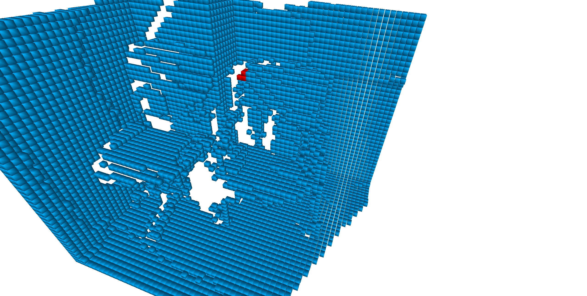  |  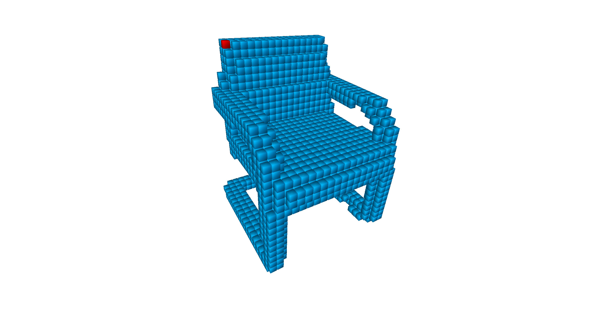 
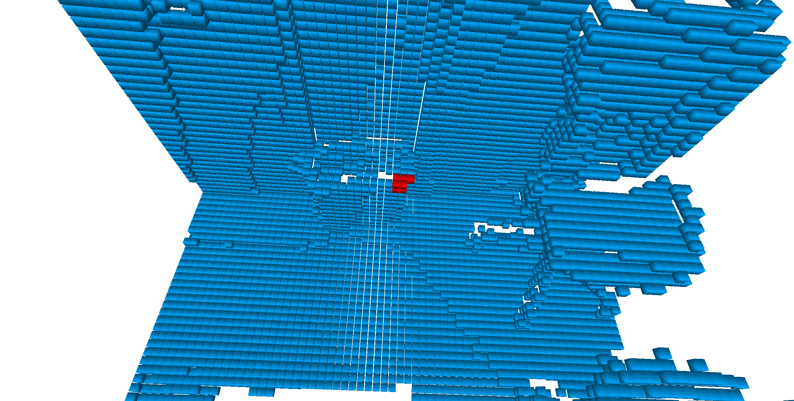  |  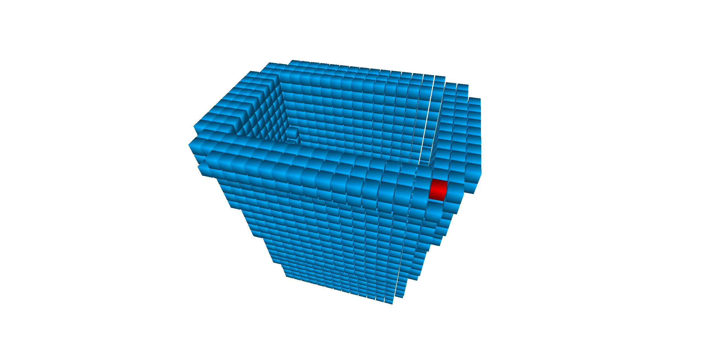 

## Citation

If you use this dataset or code please cite:

```
@InProceedings{Avetisyan_2019_CVPR,
author = {Avetisyan, Armen and Dahnert, Manuel and Dai, Angela and Savva, Manolis and Chang, Angel X. and Niessner, Matthias},
title = {Scan2CAD: Learning CAD Model Alignment in RGB-D Scans},
booktitle = {The IEEE Conference on Computer Vision and Pattern Recognition (CVPR)},
month = {June},
year = {2019}
}
```
